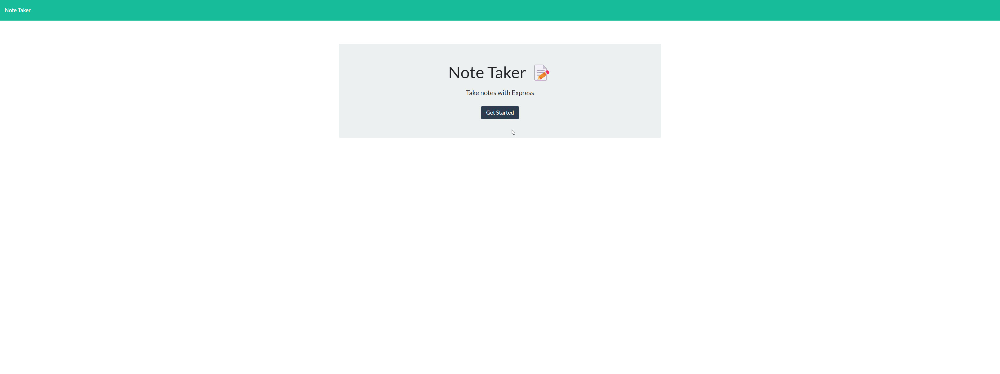

# Note Taker!

  

--------------------------

## Technology Used 🖥️

| Technology Used         | Resource URL           | 
| ------------- |:-------------:| 
| JavaScript | [https://developer.mozilla.org/en-US/docs/Web/JavaScript](https://developer.mozilla.org/en-US/docs/Web/JavaScript)     |  
| Express | [https://expressjs.com/](https://expressjs.com/)     |  
| node.js | [https://nodejs.org/en](https://nodejs.org/en)     |     
| HTML    | [https://developer.mozilla.org/en-US/docs/Web/HTML](https://developer.mozilla.org/en-US/docs/Web/HTML)|  
| CSS     | [https://developer.mozilla.org/en-US/docs/Web/CSS](https://developer.mozilla.org/en-US/docs/Web/CSS)      |    
| Git | [https://git-scm.com/](https://git-scm.com/)     |   

---------------------------

## Description 📝

Take notes, jot down ideas, and clear out your mind with this app! 

By utilizing node.js along with express, we're able to save user notes in the server itself to be referenced later.

-----------------------

## Table of Contents 📋
* [Installation Instructions](#installation-instructions-📥)
* [Usage Information](#usage-information-✅)
* [Author Info](#author-info-👺)
* [Questions?](#questions-❓)
* [License](#license-🚩)

----------------------

## Installation Instructions 📥

If you'd like to install this application on your own server, please follow the steps below:

1. Clone this GitHub repo down on to your local machine OR download the files.
2. Open up your terminal in the folder that has the files.
3. Run `npm i` to download all the required node modules.
4. Run `node server.js`.
5. Go to `http://localhost:3001` to view it on your local machine.
6. Alternatively, you can also go to [https://daevid-notepad.herokuapp.com/](https://daevid-notepad.herokuapp.com/) to view it online.

------------------------

## Usage Information ✅

To use the app, follow the steps below:
1. On the right hand side, type in your notes title along with your notes body text.
2. In the upper right, on the navbar, click on the save icon
3. If you'd like to view the note you've just made, click on the note title in the left hand side.

------------------------

## Author Info 👺

### ***daevidvo***
* [Github](github.com/daevidvo)
* [LinkedIn](linkedin.com/in/daevidvo)
* [Instagram](instagram.com/daevidvo)

--------------------------

## Questions ❓

Email me at: [daevidvo@gmail.com](mailto:daevidvo@gmail.com) or [visit my GitHub](github.com/daevidvo)

------------------------

## License 🚩

https://opensource.org/licenses/MIT

The MIT License (MIT)
=====================

Copyright © daevidvo

Permission is hereby granted, free of charge, to any person
obtaining a copy of this software and associated documentation
files (the “Software”), to deal in the Software without
restriction, including without limitation the rights to use,
copy, modify, merge, publish, distribute, sublicense, and/or sell
copies of the Software, and to permit persons to whom the
Software is furnished to do so, subject to the following
conditions:

The above copyright notice and this permission notice shall be
included in all copies or substantial portions of the Software.

THE SOFTWARE IS PROVIDED “AS IS”, WITHOUT WARRANTY OF ANY KIND,
EXPRESS OR IMPLIED, INCLUDING BUT NOT LIMITED TO THE WARRANTIES
OF MERCHANTABILITY, FITNESS FOR A PARTICULAR PURPOSE AND
NONINFRINGEMENT. IN NO EVENT SHALL THE AUTHORS OR COPYRIGHT
HOLDERS BE LIABLE FOR ANY CLAIM, DAMAGES OR OTHER LIABILITY,
WHETHER IN AN ACTION OF CONTRACT, TORT OR OTHERWISE, ARISING
FROM, OUT OF OR IN CONNECTION WITH THE SOFTWARE OR THE USE OR
OTHER DEALINGS IN THE SOFTWARE.
